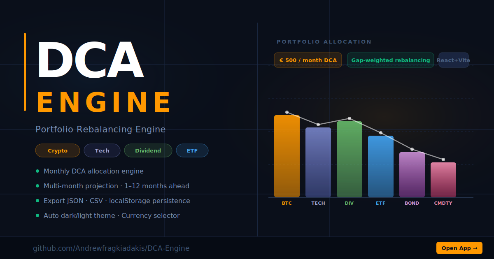

# DCA Engine — Portfolio Rebalancing

> Dollar-Cost Averaging rebalancing engine. Track, project, and rebalance your portfolio with intelligent monthly allocation.

[](https://dca-engine.vercel.app)


---



---

## Features

- **Gap-weighted DCA allocation** — buys the most under-weight assets first each month
- **Multi-month projection** — simulate 1–12 months of contributions
- **Platform selector** — Trade Republic, Interactive Brokers, Revolut, eToro, DEGIRO, Robinhood, Coinbase, Binance, Scalable Capital, and more
- **Auto light/dark theme** — follows system preference + time-of-day (07:00–20:00)
- **DCA picker modal** — presets + custom amount for fast monthly budget updates
- **What-If DCA slider** — test different budgets per month tab without committing
- **Lock-in workflow** — confirm buys, apply to portfolio, and record monthly history
- **Safety valve + drift analysis** — health tab shows allocation drift and rebalancing pressure
- **Live market proxy (serverless)** — fetch quotes through `/api/market/*` to avoid CORS and key exposure
- **Provider routing by asset class** — equities/ETF via Twelve Data → Finnhub → Polygon, crypto via CoinGecko → CoinMarketCap → Binance
- **Live PnL engine** — total return, daily return, and top contributor rows with FX support
- **Smart drift alerts** — threshold-based alerts with instant suggested buy amounts
- **Broker import adapters** — Trade Republic / IBKR CSV import + API adapter scaffolds
- **Price snapshots** — local rolling snapshots + optional remote persistence to Supabase via proxy
- **Export / Import** — JSON backup, CSV export, full import restore
- **Currency selector** — €, $, £, CHF
- **PWA-ready** — installable, works offline after first load
- **Local-first data model** — works without accounts; backend is only for market/FX proxying

## Getting Started

```bash
npm install
npm run dev      # → http://localhost:5173
npm run build    # production build → dist/
npm run preview  # preview production build
```

### Optional Environment Variables (for richer live quotes)

Set these in Vercel Project Settings → Environment Variables:

- `TWELVE_DATA_API_KEY`
- `FINNHUB_API_KEY`
- `POLYGON_API_KEY`
- `COINMARKETCAP_API_KEY`

Optional snapshot persistence to Supabase:

- `SUPABASE_URL`
- `SUPABASE_SERVICE_ROLE_KEY`

Without keys, the app still works and crypto/FX providers continue with public fallbacks.

## Stack

| Layer | Technology |
|-------|------------|
| UI | React 18 |
| Bundler | Vite 5 |
| Styling | CSS-in-JS (inline `getCSS()`) |
| Storage | `localStorage` (schema v4) + optional Supabase snapshots |
| API Proxy | Vercel Serverless Functions (`/api/market/*`) |
| Hosting | Vercel |
| Dependencies | None (zero runtime deps) |

## Project Structure

```
src/
  PortfolioRoadmap.jsx   # entire app — single-file architecture
  services/
    marketData.js         # quote/fx client + PnL model + snapshots
    brokerImport.js       # CSV parsers + broker adapter scaffolds
api/
  market/
    quotes.js             # market provider proxy + TTL cache
    fx.js                 # FX conversion proxy + TTL cache
    snapshots.js          # optional Supabase persistence bridge
public/
  favicon.svg            # brand icon
  og-image.svg           # Open Graph / social preview
  site.webmanifest       # PWA manifest
index.html               # SEO, OG tags, JSON-LD
vercel.json              # security headers + SPA rewrites
```

## License

Licensed under the [MIT License](LICENSE).

Copyright (c) 2026 Andrew Fragkiadakis
